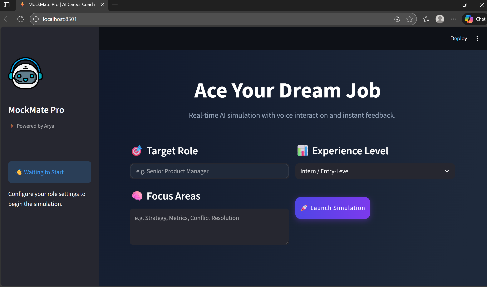
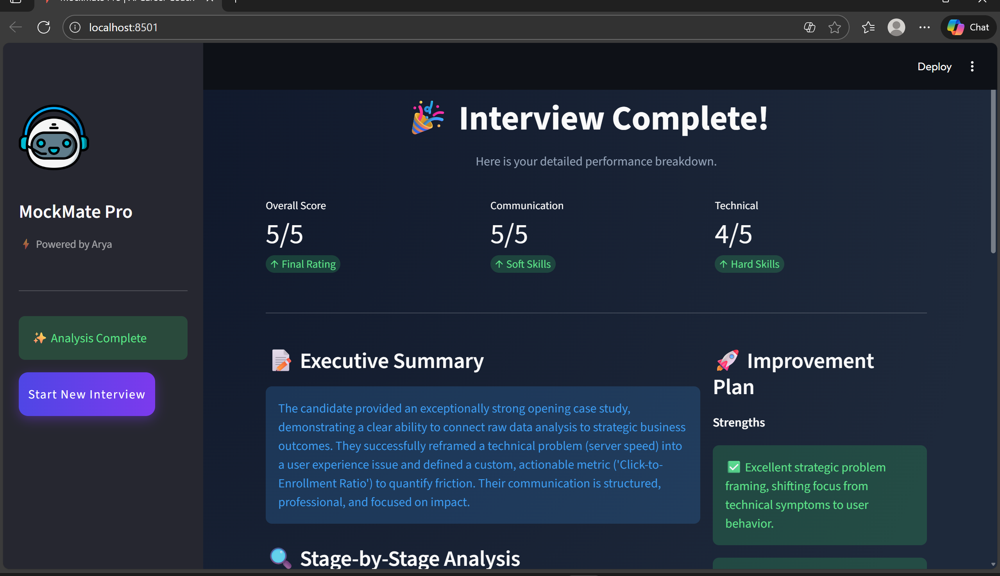

# ⚡ MockMate Pro

**AI-Powered Career Coach & Interview Simulator**

Ace your dream job with real-time voice simulation, behavioral analysis, and instant professional feedback.

---


Badges:
- 
- 
- 
- 

---

## Overview

**MockMate Pro** is a full-cycle interview simulation platform that mimics high-pressure interview environments. Powered by Google Gemini, it conducts adaptive technical, behavioral, and situational interview rounds, listens to voice input, analyzes answers in real time, and generates a professional PDF performance report.

---

## Demo Showcase

1. **The Launchpad**
   Configure role, experience level, and focus areas (e.g., System Design, Soft Skills). This is the starting point for customizing the AI interviewer's persona.

   

2.  **Real-Time Simulation**
    Voice-enabled interaction with "Thinking" indicators and dynamic typing effects. The AI adapts to your answers using contextual follow-ups and the hidden MOVING_ON signal to manage the interview stage flow.

    

3.  **Performance Analytics**
    Instant feedback on Communication vs. Technical skills, with a detailed breakdown. This section displays the JSON output generated by the AI agent and rendered visually by Streamlit.

    

Sample report: [assets/MockMate_Report.pdf.pdf]
---

## Key Features

- 🎙️ Voice-to-Text Integration (microphone input)
- 🧠 Adaptive AI Logic (contextual follow-ups)
- 🎨 Glassmorphism UI with Dark Mode
- 📊 Quantitative Scoring (skill-level breakdown)
- 📥 Export transcript (JSON) and formatted PDF report

---

## Tech Stack

- Frontend: Streamlit (Python)
- AI Model: Google Gemini (1.5 / 2.5)
- Audio: streamlit-mic-recorder
- Report Generation: FPDF
- Styling: Custom CSS / HTML

---

## Installation

Prerequisites:
- Python 3.10+
- Google Gemini API Key

1. Clone the repository
```bash
https://github.com/27arya23/Eightfold_Interview_Agent.git
cd Eightfold_Interview_Agent
```

2. Create and activate a virtual environment
```bash
python -m venv venv
# Windows
venv\Scripts\activate
# macOS / Linux
source venv/bin/activate
```

3. Install dependencies
```bash
pip install -r requirements.txt
```

4. Add environment variables  
Create a `.env` in the project root:
```
GEMINI_API_KEY=your_api_key_here
```

5. Run the app
```bash
streamlit run app.py
```

---

## Project Structure

```
mockmate-pro/
├── app.py                 # Main Streamlit application
├── interview_agent.py     # AI logic & prompt engineering
├── interview_state.py     # Session state management
├── requirements.txt       # Python dependencies
├── .env                   # API keys (exclude from VCS)
└── assets/                # Images and sample PDF
    ├── landing_page.png
    ├── interview_live.png
    └── MockMate_Report.pdf
```

---

## Contributing

1. Fork the repo  
2. Create a branch: git checkout -b feature/AmazingFeature  
3. Commit changes: git commit -m "Add feature"  
4. Push: git push origin feature/AmazingFeature  
5. Open a pull request

---

## License

Distributed under the MIT License. See LICENSE for details.

---

Built with 💜


